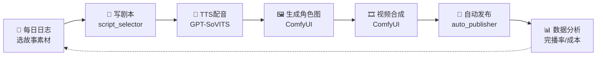

# 🏭 AI 短剧制作流水线

> Excalidraw 流程图
> 打开后按思维导图/流程图模式查看

---

## 📋 各环节工具

|   环节   | 工具                |   状态   |
| :----: | ----------------- | :----: |
| 📝 剧本  | Claude + 模板       |  ✅ 可用  |
| 🎤 配音  | GPT-SoVITS API    | ⚠️ 待训练 |
| 🖼️ 角色 | ComfyUI           |  ✅ 可用  |
| 🎞️ 合成 | ComfyUI + FFmpeg  | ⚠️ 待优化 |
| 🚀 发布  | auto_publisher.py | ⏳ 待开发  |
| 📊 分析  | 数据面板              |  ✅ 可用  |
