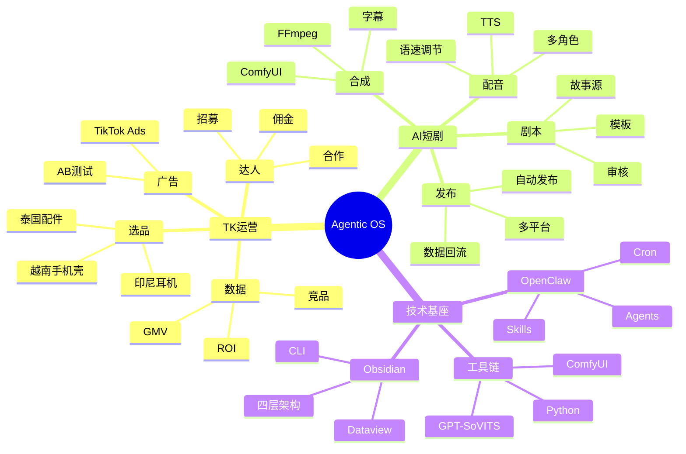

# 🧠 知识体系思维导图

> 基于 Mind Map 插件查看效果最佳

---



## 📂 目录结构

```
knowledge-base/
├── 00-入口/         ← 导航 + 看板 + 流水线
├── raw/             ← 原始资料
├── wiki/            ← 知识库
│   ├── TK运营/     ← TK 知识
│   ├── Drama制作/  ← 短剧知识
│   ├── 技术文档/   ← 技术文档
│   └── 业务架构/   ← PRD + 评估
├── projects/        ← 项目产出
├── daily/           ← 工作日志
├── skills/          ← 技能包
├── templates/       ← 模板
└── archive/         ← 归档
```
