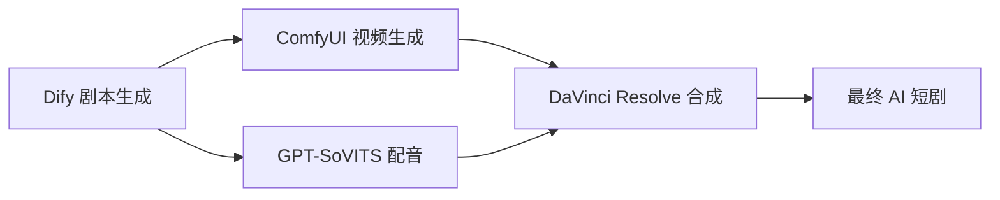

# 🎬 AI 短剧自动化生产系统

> **完整工作流**: Dify + ComfyUI + GPT-SoVITS + DaVinci Resolve  
> **案例项目**: 武松打虎 AI 数字短剧  
> **状态**: ✅ 全流程已验证

---

## 📚 指南目录

### 1. [Dify + ComfyUI 行业最佳实践](01-Dify-ComfyUI-Best-Practices.md)
- Dify 剧本生成器配置
- ComfyUI 视频生成工作流
- IPAdapter 角色一致性控制
- 批量场景处理策略

### 2. [GPT-SoVITS 详细操作指南](02-GPT-SoVITS-Guide.md)
- 数据准备与预处理
- S1/S2 阶段模型训练
- WebUI 推理操作
- 批量配音生成脚本
- Apple Silicon 优化设置

### 3. [DaVinci Resolve 集成指南](03-DaVinci-Resolve-Integration.md)
- Resolve 安装与命令行配置
- 自动化项目创建
- 字幕自动生成与集成
- 最终视频渲染
- 质量控制检查清单

---

## 🔗 工作流概览



---

## 📁 项目文件结构

```
~/AI_Short_Drama_Pipeline/
├── workflows/              # 工作流配置文件
├── automation/             # 自动化脚本
├── assets/                 # 参考素材
│   └── characters/         # 角色参考图
├── input/                  # 输入素材
├── output/                 # 输出文件
└── scripts/                # 辅助脚本
```

---

## 🚀 快速开始

1. **启动服务**:
   ```bash
   # Dify
   docker-compose -f ~/difai/docker-compose.yaml up -d
   
   # ComfyUI  
   cd ~/ComfyUI && python main.py --listen 127.0.0.1 --port 8188
   
   # GPT-SoVITS
   cd ~/GPT-SoVITS && python webui.py
   ```

2. **访问服务**:
   - Dify: http://localhost:9000
   - ComfyUI: http://127.0.0.1:8188  
   - GPT-SoVITS: http://127.0.0.1:9874

3. **运行完整流水线**:
   ```bash
   python ~/AI_Short_Drama_Pipeline/automation/complete_workflow.py
   ```

---

## 📝 版本信息

- **Dify**: v1.13.3
- **ComfyUI**: v0.19.1 + WanVideoWrapper + IPAdapter_plus
- **GPT-SoVITS**: v2 ProPlus
- **Wan2.1 模型**: 14B (26.6GB)
- **DaVinci Resolve**: v21.0.0
- **最后更新**: 2026-04-20

---